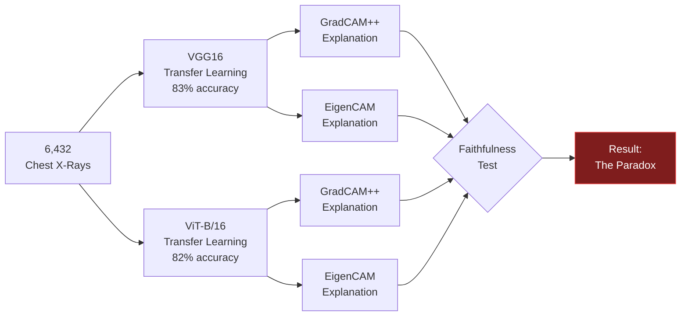
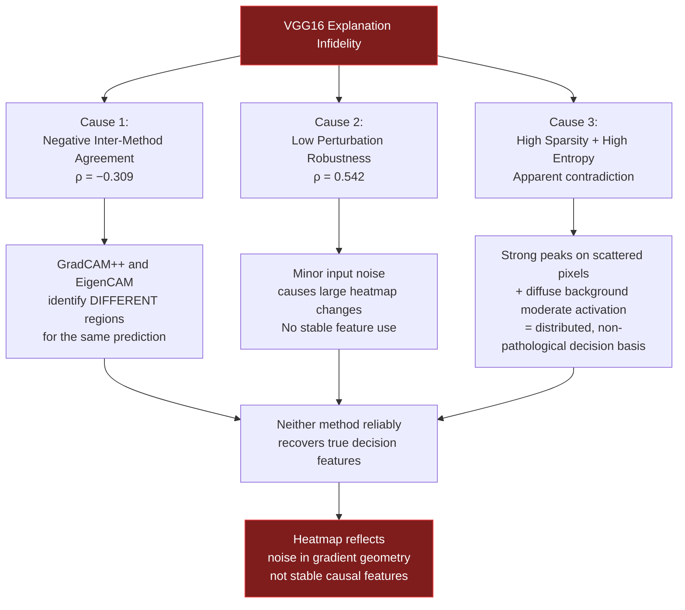
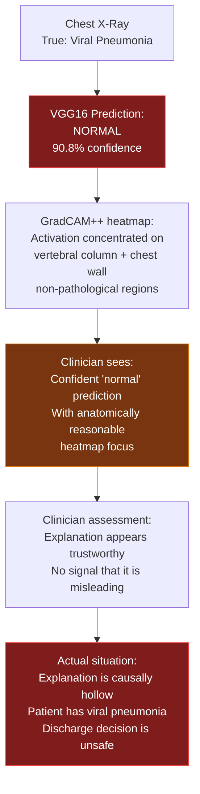
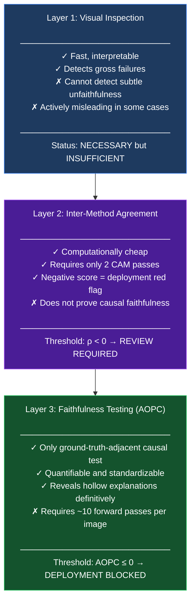

<div align="center">

# Case Study: The Explainability Paradox
### When Visually Convincing AI Explanations Are Causally Hollow

<br/>

[](README.md)
[](METHODOLOGY.md)
[](#)

</div>

---

## Background

Modern clinical AI systems are increasingly required to provide not just predictions but *explanations* — visual evidence that the model is reasoning about the right parts of the image. In chest X-ray analysis, this typically means a heatmap overlay showing which pixels most influenced the model's diagnosis.

The implicit assumption behind this practice is straightforward: **if a heatmap looks clinically meaningful, it must reflect the model's actual reasoning.**

This case study documents how that assumption breaks down — and what the consequences are for patient safety.

---

## The Setup

We trained three deep learning models on a 6,432-image chest X-ray dataset and applied two CAM-based explanation methods to the two best-performing models:



The key question we asked was not *"does the heatmap look right?"* but *"if we remove the pixels the heatmap claims are most important, does the model's confidence drop?"*

A faithful explanation should cause **confidence to fall** as highlighted pixels are removed. An unfaithful one causes confidence to stay flat — or rise.

---

## The Finding: Two Opposite Profiles

### VGG16 — The Plausible But Hollow Explainer

VGG16 produces heatmaps that a radiologist would recognize as clinically reasonable. For COVID-19 cases, the activation maps concentrate over bilateral lower lung zones, consistent with known patterns of ground-glass opacification. For bacterial pneumonia, broad lobar coverage matches the expected radiographic footprint of consolidation.

**Yet the faithfulness test tells a different story entirely.**

```
Progressive pixel deletion — VGG16:

  Fraction removed │ 0%   10%   20%   33%   50%   70%   90%
  Model confidence │ 0.47  0.51  0.61  0.74  0.82  0.91  0.98
                   │  ↑     ↑     ↑     ↑     ↑     ↑     ↑
                   │            CONFIDENCE RISES
```

VGG16's confidence **monotonically increases** as its most-important highlighted pixels are removed. By the time 90% of the heatmap-identified pixels are gone, the model is *more confident* than when it had the full image.

**AOPC = −0.012** — the average confidence change is essentially zero, marginally negative. The explanation has no causal relationship to the prediction.

What this means: VGG16's actual decision is driven by pixels its heatmap does **not** highlight — background regions, structural landmarks, scanner artifacts, patient positioning markers.

### ViT-B/16 — The Imperfect But Honest Explainer

ViT-B/16's heatmaps are less visually consistent. Some samples show sharp concentrated bilateral activations; others exhibit patchier coverage or edge-focused attention that a radiologist might find puzzling. By conventional visual inspection, several ViT heatmaps would be rated as less convincing than their VGG16 counterparts.

**Yet the faithfulness test confirms genuine causal structure.**

```
Progressive pixel deletion — ViT-B/16:

  Fraction removed │ 0%   10%   20%   33%   50%   70%   90%
  Model confidence │ 0.99  0.96  0.81  0.63  0.52  0.44  0.41
                   │        ↓     ↓     ↓     ↓     ↓     ↓
                   │            CONFIDENCE FALLS
```

ViT-B/16's confidence drops sharply from 0.99 to 0.41 as decision-relevant pixels are progressively removed. The curves cross at approximately 33% deletion — the point beyond which VGG16's spurious background confidence begins to dominate.

**AOPC = +0.199** — a meaningfully positive score confirming that the highlighted pixels genuinely drive the prediction.

---

## Why This Happens: Three Interlocking Causes



**Cause 1: Method disagreement.** VGG16's inter-method agreement score is −0.309 — GradCAM++ and EigenCAM actively disagree about which regions drive its predictions. When two independently derived methods contradict each other, neither can be trusted.

**Cause 2: Gradient instability.** VGG16's 13 stacked convolutional layers with nonlinear activations create a highly non-smooth gradient landscape. Small changes in input pixels produce large, erratic changes in gradient-based importance scores. The heatmap captures a snapshot of local gradient geometry, not stable feature use.

**Cause 3: Decision basis is non-pathological.** The combination of high sparsity (0.466) and high entropy (5.159) — superficially contradictory — is reconciled by a model whose decision relies on distributed, low-level statistical image properties rather than coherent pathological structures. The actual decision signal is in the background.

---

## The Clinical Risk: A Concrete Example

The qualitative analysis identified a VGG16 prediction of **Normal** with **90.8% confidence** on an image whose ground truth was **Viral Pneumonia**.



The danger here is not that the model made a wrong prediction — that is expected at 83% accuracy. The danger is that **the explanation actively reinforced the wrong decision** by appearing to confirm anatomically plausible reasoning. A clinician relying on visual heatmap validation would have no quantitative signal that the explanation was misleading.

Only the AOPC faithfulness test reveals the failure.

---

## The Three-Layer Validation Framework

Based on these findings, we propose that heatmap-based explanation evaluation must operate across three ascending layers of rigor:



---

## Implications for the Field

This study demonstrates that the dominant validation practice in medical AI explainability — presenting GradCAM-style heatmaps and asking whether they look clinically reasonable — can systematically endorse models whose explanations are causally hollow.

The consequence is not merely academic. A model with a negative AOPC deployed in a clinical setting with heatmap visualization would actively deceive the clinicians relying on it, providing a false sense of transparency that is more dangerous than acknowledged uncertainty.

We argue that AOPC-based faithfulness evaluation should be treated as a **clinical safety requirement**, not an optional post-hoc analysis.

---

<div align="center">

**[← Back to README](README.md)   ·   [Read the Methodology →](METHODOLOGY.md)**

*Paper under peer review. Full results and code will be released upon publication.*

</div>
