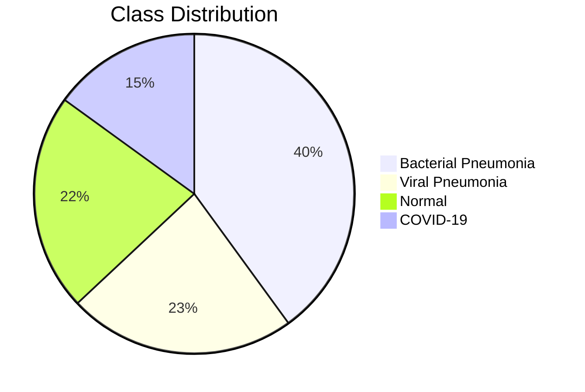
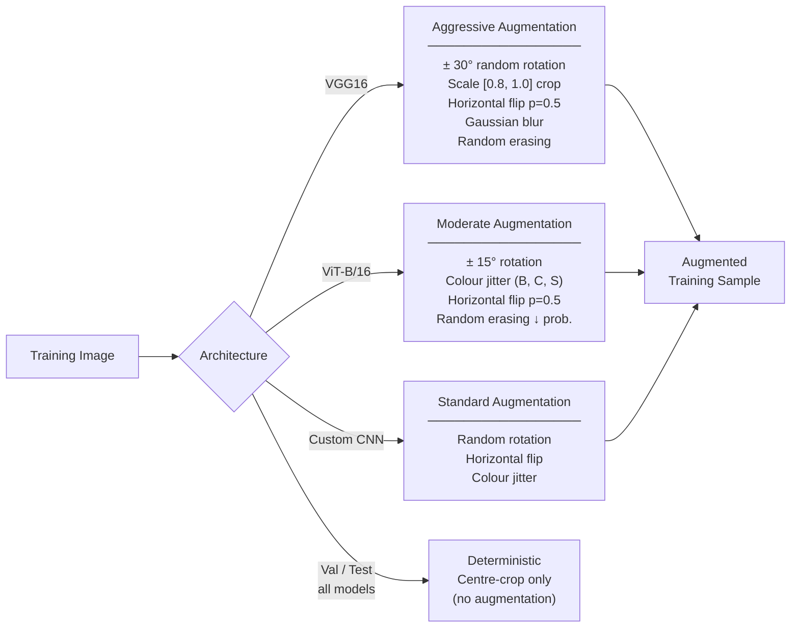
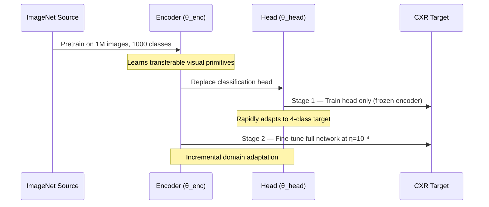

<div align="center">

# Technical Methodology
### Architecture, Training, and Evaluation Reference

<br/>

[](README.md)
[](CASE_STUDY.md)

</div>

---

## Table of Contents

1. [Dataset](#1-dataset)
2. [Preprocessing Pipeline](#2-preprocessing-pipeline)
3. [Data Augmentation](#3-data-augmentation)
4. [Transfer Learning Formulation](#4-transfer-learning-formulation)
5. [Model Architectures](#5-model-architectures)
6. [Loss Function](#6-loss-function)
7. [Training Configuration](#7-training-configuration)
8. [Evaluation Metrics](#8-evaluation-metrics)
9. [Explainability Framework](#9-explainability-framework)
10. [Faithfulness Evaluation](#10-faithfulness-evaluation)

---

## 1. Dataset



| Property | Value |
|---|---|
| Total images | 6,432 posterior-anterior chest X-rays |
| Source | Kaggle — Pneumonia & COVID-19 Image Dataset (GiBi13) |
| Classes | Normal · Bacterial Pneumonia · Viral Pneumonia · COVID-19 |
| Split | 80 / 10 / 10 (train / val / test) — stratified |
| Imbalance | COVID-19 underrepresented; handled via weighted loss |

**Splitting strategy:** Stratified split preserves class proportions across all three partitions. The test set is withheld entirely until final evaluation — it participates in no model selection or hyperparameter decision.

---

## 2. Preprocessing Pipeline

All images pass through a fixed deterministic preprocessing pipeline before model ingestion:

```
Raw Image
    │
    ▼
① Convert to 3-channel RGB
    │   (satisfies ImageNet-pretrained model input requirements)
    ▼
② Resize to 224 × 224 pixels
    │   (native resolution for both VGG16 and ViT-B/16)
    ▼
③ Normalize: x̂⁽ᶜ⁾ = (x⁽ᶜ⁾ − μ⁽ᶜ⁾) / σ⁽ᶜ⁾
    │
    │   μ = (0.485, 0.456, 0.406)   [ImageNet channel means]
    │   σ = (0.229, 0.224, 0.225)   [ImageNet channel stds]
    │
    ▼
Normalized Tensor  ∈  [−3, 3]³ˣ²²⁴ˣ²²⁴
```

The ImageNet normalization aligns the input distribution with the pre-training regime, stabilizing gradient flow during fine-tuning.

---

## 3. Data Augmentation

Augmentation is applied **exclusively to the training set** and is tailored per architecture to account for differing structural sensitivities.



**Why different strategies?** ViT-B/16 lacks hard-coded spatial inductive biases. Preliminary experiments showed that aggressive geometric augmentation — effective for VGG16 — produced training instability in the transformer. The moderated pipeline reflects this empirical finding.

---

## 4. Transfer Learning Formulation

### Mathematical Framework

Let a source model parameterized by θ = {θ_enc, θ_head} decompose into an encoder and classification head:

```
Feature extraction:
    z = φ_θenc(x)     where φ: X → ℝᵈ

Stage 1 — Frozen backbone:
    θ*_head = argmin_θhead  L( g_θhead( φ_θ*enc(x) ), y )

Stage 2 — End-to-end fine-tuning:
    θ* = argmin_θ  E_(x,y)~D_T [ L(f_θ(x), y) ]
```

Stage 1 rapidly adapts the classification head to the target label space without corrupting pretrained backbone representations. Stage 2 makes incremental adjustments at a conservative learning rate η = 10⁻⁴, refining rather than overwriting the initialization advantage.



---

## 5. Model Architectures

### VGG16

```
Input: 224 × 224 × 3
    │
    ├── Conv Block 1:  2 × Conv(64, 3×3) + MaxPool
    ├── Conv Block 2:  2 × Conv(128, 3×3) + MaxPool
    ├── Conv Block 3:  3 × Conv(256, 3×3) + MaxPool
    ├── Conv Block 4:  3 × Conv(512, 3×3) + MaxPool
    └── Conv Block 5:  3 × Conv(512, 3×3) + MaxPool
                                │
    Convolutional operation per layer:
    F⁽ᵏ⁾ᵢⱼ = ReLU( Σ_c,p,q  W⁽ᶜ⁾_k[p,q] · F⁽ᶜ⁾[i+p, j+q] + b_k )
                                │
    ├── Dropout(p=0.5)
    ├── FC(4096 → 512, ReLU)
    └── FC(512 → 4, Softmax)

CAM target layer: features[28]  →  7 × 7 spatial maps
Trainable params: ~138M (backbone) + ~2M (custom head)
```

**Why VGG16?** Its architectural purity — strictly stacked 3×3 convolutions with no residual connections or attention — isolates the effect of pure convolutional inductive bias, making it the ideal representative of classical CNN behavior.

### ViT-B/16

```
Input: 224 × 224 × 3
    │
    Patch partition:  N = 224²/16² = 196 patches of size 16×16
    │
    Linear projection:  z⁽⁰⁾_p = E·x_p + e^pos_p
                        E ∈ ℝ^(D × P²C),  D = 768
    │
    Prepend [CLS] token → sequence length = 197
    │
    × 12 Transformer Encoder Blocks:
    │   ├── LayerNorm
    │   ├── Multi-Head Self-Attention (12 heads, d_k = 64)
    │   │     Attn(Q,K,V) = softmax( QKᵀ / √d_k ) V
    │   ├── Residual connection
    │   ├── LayerNorm
    │   ├── FFN: FC(768 → 3072 → 768, GELU)
    │   └── Residual connection
    │
    Extract z⁽ᴸ⁾_CLS
    │
    └── Linear(768 → 4, Softmax)

CAM target layer: final encoder block → reshaped to 14 × 14
Trainable params: ~86M
```

### Custom CNN (Baseline)

```
Input: 224 × 224 × 3
    │
    ├── Conv Block 1:  Conv(32, 3×3) → BN → ReLU → Conv(32, 3×3) → BN → ReLU → MaxPool → Dropout
    ├── Conv Block 2:  Conv(64, 3×3) → BN → ReLU → Conv(64, 3×3) → BN → ReLU → MaxPool → Dropout
    ├── Conv Block 3:  Conv(128, 3×3) → BN → ReLU → Conv(128, 3×3) → BN → ReLU → MaxPool → Dropout
    └── Conv Block 4:  Conv(256, 3×3) → BN → ReLU → Conv(256, 3×3) → BN → ReLU → MaxPool → Dropout
                                │
    Global Average Pooling
    FC(256 → 512, ReLU)
    FC(512 → 4, Softmax)

Initialization: random weights
Purpose: quantify the benefit of pretraining
```

---

## 6. Loss Function

Standard cross-entropy on an imbalanced dataset produces biased gradients that disproportionately reflect majority classes. We apply class-weighted cross-entropy:

```
Class weight:
    wₖ = N / (K · nₖ)

    where:  N  = total training samples
            K  = 4 (number of classes)
            nₖ = samples in class k

Per-sample loss:
    ℓ(xᵢ, yᵢ) = −w_yi · Σₖ 𝟏[yᵢ=k] · log p̂ₖ(xᵢ)

Batch loss:
    L_WCE(B) = −(1/|B|) · Σᵢ∈B  w_yi · log p̂_yi(xᵢ)
```

Minority classes (COVID-19, viral pneumonia) receive amplified weights. Majority classes are down-weighted proportionally. This formulation equalizes the effective per-class contribution to the aggregate gradient without any data resampling.

---

## 7. Training Configuration

| Hyperparameter | Value | Applies To |
|---|---|---|
| Optimizer | Adam | All models |
| Learning rate η | 1 × 10⁻⁴ | All models |
| Batch size | 32 | All models |
| Maximum epochs | 15 | All models |
| Loss function | Weighted cross-entropy | All models |
| Input resolution | 224 × 224 | All models |
| Dropout (VGG16 head) | 0.5 | VGG16 only |
| Early stopping patience | P = 3 epochs | TL models |
| Early stopping threshold | δ = 10⁻⁴ | TL models |
| Checkpoint criterion | Minimum val. loss | TL models |

**Early stopping:** Training halts if validation loss fails to improve by δ for P consecutive epochs. The checkpoint corresponding to minimum validation loss is restored for test evaluation.

### Training Outcomes

```mermaid
gantt
    title Training Timeline (epochs)
    dateFormat X
    axisFormat Ep %s

    section VGG16
    Training        :0, 6
    Best checkpoint :milestone, 1, 0

    section ViT-B/16
    Training        :0, 7
    Best checkpoint :milestone, 2, 0

    section Custom CNN
    Training        :0, 15
    Best checkpoint :milestone, 10, 0
```



| Model | Stop Epoch | Best Val Acc | Best Val Loss | Train Time |
|---|:---:|:---:|:---:|:---:|
| VGG16 (TL) | 6 | 84.48% | 0.4021 | ~3.3 min |
| ViT-B/16 (TL) | 7 | 82.38% | 0.4169 | ~5.4 min |
| Custom CNN | 15 | 74.37% | 0.8472 | ~11.1 min |

---

## 8. Evaluation Metrics

### Classification

```
Accuracy:       (TP_total) / N_test

Per-class:
    Precision:  TPₖ / (TPₖ + FPₖ)
    Recall:     TPₖ / (TPₖ + FNₖ)
    F1:         2 · Pₖ · Rₖ / (Pₖ + Rₖ)

Weighted F1:    Σₖ (nₖ / N_test) · F1ₖ
```

Weighted F1 serves as the primary aggregate metric because it accounts for class imbalance.

---

## 9. Explainability Framework

### GradCAM++

GradCAM++ computes a weighted combination of positive partial derivatives of the class score with respect to the final convolutional feature maps:

```
Weight for feature map k, class c:
    αᶜₖ = Σᵢⱼ  wᵏᶜᵢⱼ · ReLU( ∂Yᶜ / ∂Aᵏᵢⱼ )

    where wᵏᶜᵢⱼ uses 2nd and 3rd order derivatives
    for pixel-level accurate localization

Activation map:
    Lᶜ_GradCAM++ = ReLU( Σₖ αᶜₖ Aᵏ )
```

ReLU retains only activations that contribute positively to the target class score.

For **VGG16**: applied to `features[28]` → 7×7 spatial maps  
For **ViT-B/16**: applied to final encoder block attention projection → reshaped to 14×14

### EigenCAM

EigenCAM extracts the principal component of the feature map tensor — no gradient required:

```
Feature maps:    A ∈ ℝ^(K × U × V)
Reshape:         M = reshape(A, [K, U·V]) ∈ ℝ^(K × UV)

SVD:             M = UΣVᵀ,   v₁ = V_{:,1}

Heatmap:         L_EigenCAM = reshape(Mᵀv₁, [U, V])
```

EigenCAM captures the dominant direction of variation in feature space, providing a class-agnostic but structurally grounded explanation. Using both methods enables **inter-method agreement** evaluation.

### Six Quantitative Metrics

Let H ∈ [0,1]^(H×W) be a normalized heatmap with M = H×W pixels, hᵢ the value of pixel i:

```
① Shannon Entropy:
    H(H) = −Σᵢ hᵢ log(hᵢ + ε)
    Higher → more diffuse activation

② Activation Std Dev:
    σ(H) = √( (1/M) Σᵢ (hᵢ − h̄)² )
    Higher → sharper contrast between active/inactive

③ Sparsity:
    S(H) = (1/M) Σᵢ 𝟏[hᵢ < τ],   τ = 0.1
    Higher → more selective, fewer active pixels

④ Top-k Mass Concentration:
    TopK(H, k) = (Σᵢ∈Iₖ hᵢ / Σᵢ hᵢ) × 100
    Where Iₖ = indices of top-k pixels by activation

⑤ Perturbation Robustness  ↑ better:
    ρ(H, H̃),   x̃ = x + ε,   ε ~ N(0, σ²ₙ),   σₙ = 0.05
    Pearson correlation between original and noised heatmaps

⑥ Inter-Method Agreement  ↑ better:
    ρ_inter = ρ( h_GradCAM++, h_EigenCAM )
    Pearson correlation between the two method's flat maps
    Negative → methods actively DISAGREE → unreliable
```

**Statistical testing:** Mann-Whitney U (non-normal distributions) or independent-samples t-test (normal), with Bonferroni correction:

```
α_Bonferroni = 0.05 / 6 ≈ 0.0083
```

All six comparisons were tested simultaneously. Effect sizes reported as rank-biserial r (Mann-Whitney) or Cohen's d (t-test).

---

## 10. Faithfulness Evaluation

Faithfulness asks: **does the model's explanation causally reflect its decision?**

```
Algorithm — Progressive Pixel Deletion:

Input:  image x, heatmap H, model f, target class c
Output: perturbation curve P(t), AUC, AOPC

1. Rank pixels by H in descending importance: π = [π₁, π₂, ..., πₘ]
2. For t = 0, 1, ..., T:
   a. Replace top-t% pixels with channel-wise ImageNet mean
   b. Record: P(t) = f_c( x⁽ᵗ⁾ )
3. Compute:
   AUC  = (1/T) Σ_{t=0}^{T-1}  [P(t) + P(t+1)] / 2
   AOPC = (1/T) Σ_{t=1}^{T}    [f_c(x⁽⁰⁾) − f_c(x⁽ᵗ⁾)]

Parameters: n=32 stratified images, T=10 steps (10% each)
```

**Interpretation:**

```
AUC  ↓  →  confidence decays faster as pixels removed  →  MORE faithful
AOPC ↑  →  greater average confidence drop              →  MORE faithful
AOPC > 0  →  explanation is causally faithful
AOPC ≤ 0  →  faithfulness FAILURE
```

### Results

| Model | AUC ↓ | AUC SD | AOPC ↑ | AOPC SD | Verdict |
|:---:|:---:|:---:|:---:|:---:|:---:|
| VGG16 | 0.828 | 0.119 | −0.012 | 0.140 |  Unfaithful |
| ViT-B/16 | 0.588 | 0.076 | +0.199 | 0.143 |  Faithful |

The perturbation curves cross at approximately **33% pixel deletion** — beyond this point VGG16's spurious background confidence dominates.

---

<div align="center">

**[← Back to README](README.md)   ·   [Read the Case Study →](CASE_STUDY.md)**

*Full implementation details will be released alongside the codebase upon paper publication.*

</div>
