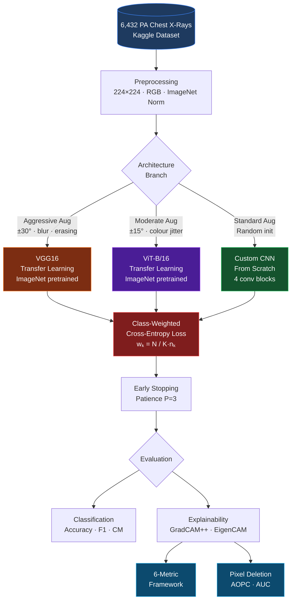
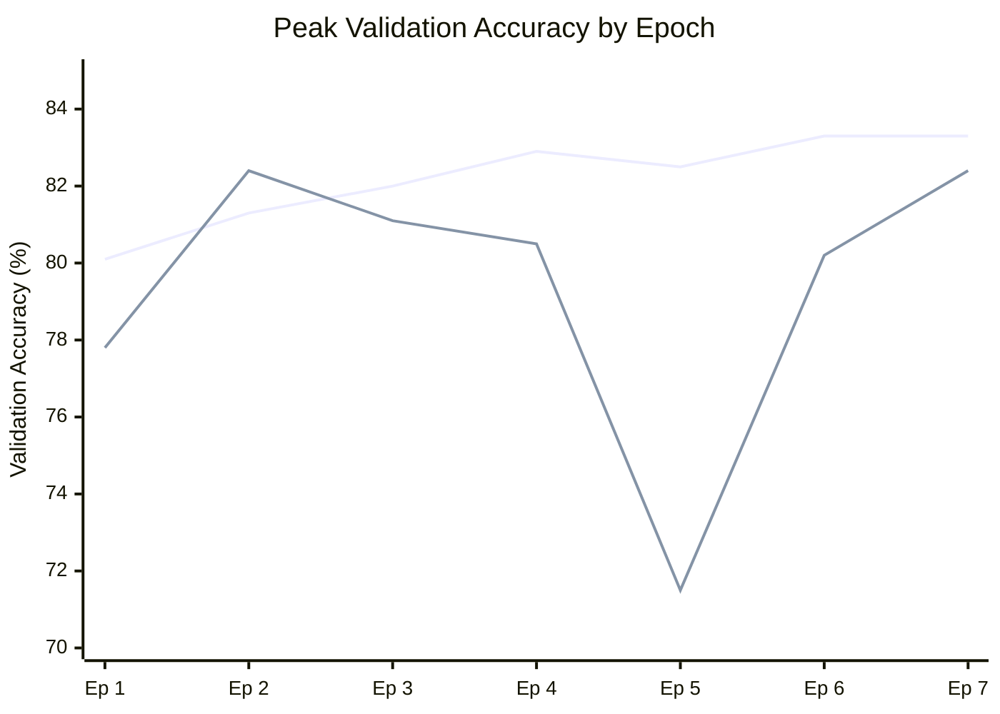
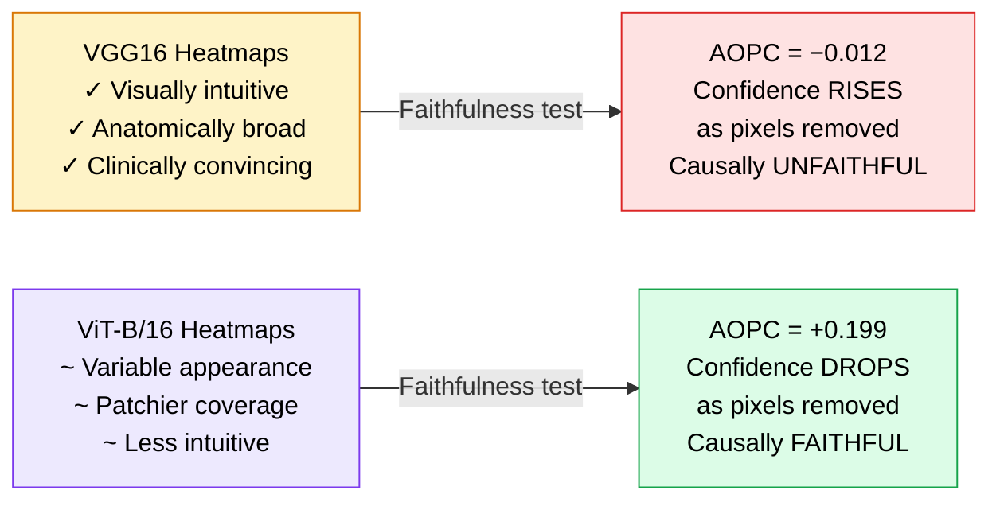
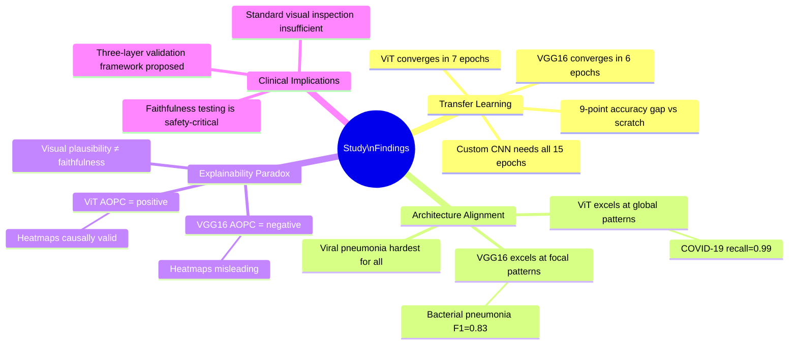

<div align="center">

# Beyond Visual Plausibility
### Faithfulness-Aware Comparison of CNNs and Vision Transformers for Chest X-Ray Classification

<br/>

[](https://python.org)
[](https://pytorch.org)
[](https://streamlit.io)
[](#)
[](LICENSE)

<br/>

> **A rigorous, multi-dimensional study evaluating not just how accurately deep learning models classify chest X-rays — but whether their explanations can actually be trusted.**

<br/>

```
Department of Computer Science
Islamic University of Science and Technology, Awantipora, J&K
Dr. Owais  ·  Shahid Ul Islam
```

<br/>

---

</div>

## The Core Question

Most deep learning studies ask: *"How accurate is the model?"*

This study asks a harder question: **"Can we trust why the model made that decision?"**

We train three architectures on a four-class chest X-ray dataset and discover a clinically significant paradox — the model that produces the most visually convincing heatmaps is the one whose explanations are causally hollow.

<br/>

## What Makes This Study Different

| Conventional Study | This Study |
|---|---|
| Reports accuracy only | Reports accuracy **+** faithfulness |
| One CAM method per model | Two CAM methods with **inter-method agreement** |
| Visual inspection of heatmaps | **Quantitative pixel deletion** (AOPC, AUC) |
| Single metric evaluation | **Six-dimensional** explainability framework |
| No statistical correction | **Bonferroni-corrected** non-parametric testing |

<br/>

## Architecture Overview



<br/>

## Classification Results

### Overall Performance

| Model | Strategy | Accuracy | Macro F1 | Wtd. F1 | Inference |
|:---:|:---:|:---:|:---:|:---:|:---:|
|  **VGG16** | Transfer Learning | **83%** | **0.84** | **0.82** | 1.068s |
|  **ViT-B/16** | Transfer Learning | **82%** | **0.84** | **0.82** | 0.977s |
| 🔹 Custom CNN | From Scratch | 74% | 0.75 | 0.74 | 0.768s |

### Class-wise F1 Scores

```
                    VGG16    ViT-B/16    Custom CNN
Normal              0.91     0.91        0.80
Bacterial Pneumonia 0.83     0.81        0.74
Viral Pneumonia     0.64     0.64        0.55
COVID-19            0.98     0.99        0.92
```

### Training Convergence



> VGG16 stopped at **epoch 6** · ViT-B/16 stopped at **epoch 7** · Custom CNN ran all **15 epochs**

<br/>

## The Explainability Paradox

> **The most visually convincing heatmaps are the least causally faithful ones.**

This is the central finding of the study. We evaluate explanations using progressive pixel deletion — removing the pixels each model's heatmap marks as most important, and measuring confidence change.



### Faithfulness Statistics

| Model | AUC ↓ | AUC SD | AOPC ↑ | AOPC SD | Verdict |
|:---:|:---:|:---:|:---:|:---:|:---:|
| VGG16 | 0.828 | 0.119 | −0.012 | 0.140 |  Unfaithful |
| ViT-B/16 | 0.588 | 0.076 | +0.199 | 0.143 |  Faithful |

*Lower AUC = confidence decays faster when important pixels removed. Higher AOPC = greater average confidence drop. Both indicate more faithful explanations.*

<br/>

## Six-Dimensional Explainability Framework

We evaluate every heatmap across six independent dimensions with Bonferroni-corrected statistical testing (α = 0.05/6 ≈ 0.0083):


| Metric | VGG16 | ViT-B/16 | Winner |
|---|:---:|:---:|:---:|
| Entropy | 5.159 ± 0.034 | 4.987 ± 0.092 | — |
| Activation Std Dev | 0.216 ± 0.018 | 0.250 ± 0.024 |  ViT |
| Sparsity | 0.466 ± 0.148 | 0.252 ± 0.116 | — |
| Top-k Mass | 16.350 ± 0.874 | 16.197 ± 0.861 | ≈ Tie |
| **Robustness ↑** | 0.542 ± 0.215 | **0.809 ± 0.217** |  ViT |
| **Inter-Method ↑** | −0.309 ± 0.483 | **+0.301 ± 0.406** |  ViT |

All six comparisons reach statistical significance (p < 0.0083 after correction).

<br/>

## Key Findings at a Glance



<br/>

## Dataset

| Property | Value |
|---|---|
| Source | [Pneumonia & COVID-19 Image Dataset](https://www.kaggle.com/datasets/gibi13/pneumonia-covid19-image-dataset) — GiBi13 on Kaggle |
| Total images | 6,432 posterior-anterior chest X-rays |
| Classes | Normal · Bacterial Pneumonia · Viral Pneumonia · COVID-19 |
| Split | 80% train / 10% validation / 10% test (stratified) |
| Imbalance handling | Class-weighted cross-entropy loss |

<br/>

## Repository Structure

```
Transfer-Learning/
├── .streamlit/                 # Streamlit configuration
├── app/
│   ├── components/             # UI components
│   └── utils/                  # Inference utilities
├── data/                       # Dataset (not tracked)
├── models/                     # Saved model checkpoints
├── notebooks/                  # Training & evaluation notebooks
├── screenshots/                # App interface screenshots
├── presentation/               # Slide deck
├── reports/                    # Figures, metrics, outputs
├── results/ 
├── src/                        # Core training & evaluation code
├── requirements.txt
└── README.md
```

> **Note:** Source code, notebooks, and trained model weights will be released publicly upon acceptance of the associated research paper, which is currently under peer review.

<br/>

## Streamlit Demo App

A full interactive diagnostic interface is included, supporting:

- Single image upload and real-time classification
- Per-class confidence scores with visual breakdown
- GradCAM++ heatmap overlay on prediction
- Model selection (VGG16 / ViT-B/16)

<br/>

## Documentation

| Document | Description |
|---|---|
| [`README.md`](README.md) | Project overview (this file) |
| [`CASE_STUDY.md`](CASE_STUDY.md) | Deep dive into the explainability paradox finding |
| [`METHODOLOGY.md`](METHODOLOGY.md) | Full technical methodology and mathematical formulations |

<br/>

## Environment Setup

```bash
git clone https://github.com/Khanz9664/Transfer-Learning-for-Respiratory-Disease-Classification.git
cd Transfer-Learning-for-Respiratory-Disease-Classification
pip install -r requirements.txt
```

### Requirements

```
torch>=2.0.0
torchvision>=0.15.0
transformers>=4.30.0
pytorch-grad-cam>=1.4.0
streamlit>=1.25.0
numpy pandas scikit-learn matplotlib seaborn pillow
```

<br/>

## Citation

If you find this work useful, please cite it once the paper is published. In the meantime you may reference the preprint or this repository:

```bibtex
@misc{owais2026beyondvisual,
  author    = {Owais and {Shahid Ul Islam}},
  title     = {Beyond Visual Plausibility: A Faithfulness-Aware Comparison of
               CNNs and Vision Transformers for Multi-Class Chest X-Ray Classification},
  year      = {2026},
  note      = {Manuscript under peer review},
  institution = {Islamic University of Science and Technology, Awantipora}
}
```

<br/>

## License

This project is released under the [MIT License](LICENSE). The dataset is subject to its original Kaggle terms of use.

<br/>

## Acknowledgements

- Dataset: [GiBi13 on Kaggle](https://www.kaggle.com/datasets/gibi13/pneumonia-covid19-image-dataset)
- Pretrained weights: PyTorch/torchvision (VGG16) and HuggingFace Transformers (ViT-B/16)
- CAM implementations: [pytorch-grad-cam](https://github.com/jacobgil/pytorch-grad-cam)

<br/>

---

<div align="center">

**Department of Computer Science · Islamic University of Science and Technology**

*This is a research prototype. Not intended for clinical use.*

</div>
