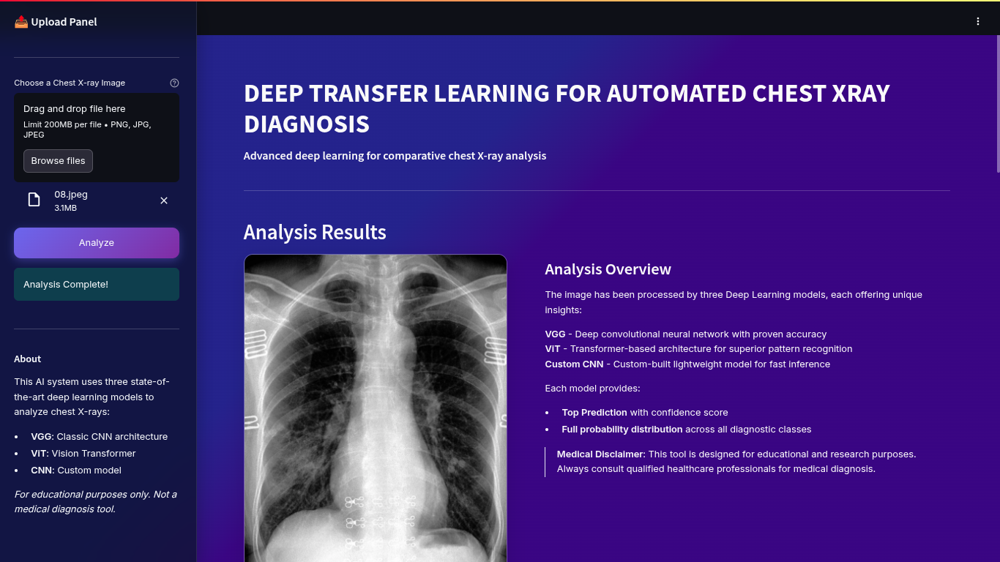
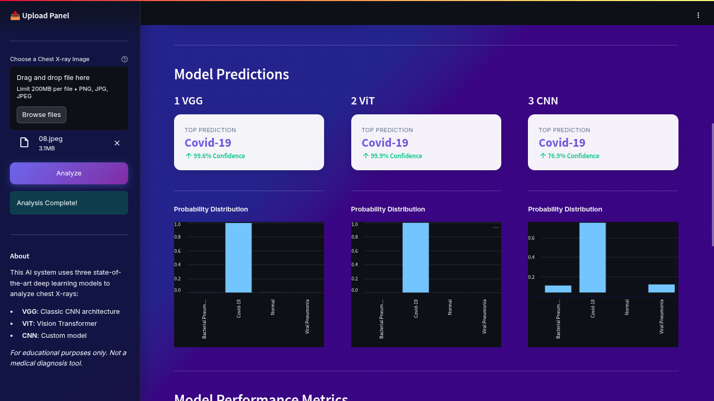
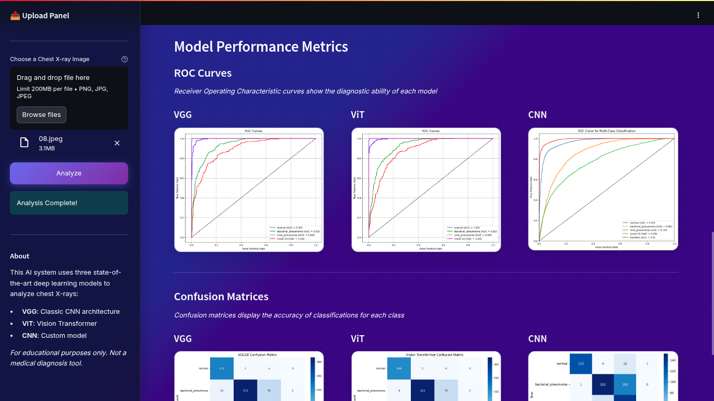

# 🩺 Transfer Learning for Respiratory Disease Classification in Chest X-Rays

A comprehensive comparative study analyzing the effectiveness of transfer learning versus training from scratch for automated diagnosis of respiratory diseases using deep learning.

## Overview

This project implements and compares three distinct deep learning approaches for classifying chest X-ray images into four categories:
- **Normal** (healthy lungs)
- **Bacterial Pneumonia**
- **Viral Pneumonia**
- **COVID-19**

The study demonstrates the significant advantages of transfer learning in medical image analysis, particularly when working with limited datasets—a common challenge in healthcare AI applications.

## Key Findings

| Model | Training Strategy | Accuracy | F1-Score | Training Time |
|-------|------------------|----------|----------|---------------|
| **VGG16** | Transfer Learning | **83.0%** | **0.84** | ~6.5 min |
| **ViT** | Transfer Learning | 81.0% | 0.81 | ~6.2 min |
| **Custom CNN** | From Scratch | 80.0% | 0.80 | ~10 min |

### Key Insights:
- **Transfer learning models achieved higher accuracy** while requiring **~60% less training time**
- **VGG16 outperformed ViT**, demonstrating the advantage of convolutional inductive bias for medical imaging
- **Near-perfect COVID-19 detection** (F1-score: 0.99) across both transfer learning models
- **Differentiating bacterial vs. viral pneumonia** remains challenging—reflecting real clinical difficulty

## Architecture & Methodology

### Overall Workflow
```
Data Collection → Preprocessing & Augmentation → Data Splitting (80/10/10)
                                                         ↓
                           ┌─────────────────────────────┴──────────────────────────┐
                           ↓                             ↓                          ↓
                    Custom CNN                       VGG16                         ViT
                (Random Initialization)      (ImageNet Pre-trained)     (ImageNet Pre-trained)
                           ↓                             ↓                          ↓
                      Training (15 epochs)         Fine-tuning                Fine-tuning
                           ↓                             ↓                          ↓
                           └─────────────────────────────┬──────────────────────────┘
                                                         ↓
                              Performance Evaluation & Comparative Analysis
```

### Models Implemented

1. **Custom CNN (Baseline)**
   - 7 convolutional blocks with progressive depth (128→512 filters)
   - ~5.4M trainable parameters
   - Trained from randomly initialized weights

2. **VGG16 (Transfer Learning)**
   - Pre-trained on ImageNet
   - Custom classifier head with dropout regularization
   - Fine-tuned end-to-end with frozen early layers

3. **Vision Transformer (ViT) (Transfer Learning)**
   - Pre-trained ViT-Base (Patch16-224)
   - Global self-attention mechanism
   - Custom MLP classification head

### Data Preparation

- **Dataset**: 6,432 chest X-ray images from Kaggle
- **Preprocessing**: Resize (224×224), RGB conversion, ImageNet normalization
- **Augmentation** (Training only):
  - Random rotation, horizontal flips
  - Color jittering, Gaussian blur
  - Random erasing for robustness
- **Class Imbalance Handling**: Weighted loss function with inverse class frequencies

## 🖥️ Application Interface


*Upload and classify chest X-rays*


*Real-time prediction with confidence scores*


*Detailed classification results*

## Detailed Results

### VGG16 Performance

*Training/validation curves showing stable convergence*


*Confusion matrix - strongest performance on COVID-19 and Normal classes*

### Vision Transformer (ViT) Performance

*ViT training dynamics with early peak validation accuracy*


*Confusion matrix showing similar patterns but slightly lower overall accuracy*

### Custom CNN (From Scratch) Performance

*Volatile training with slower convergence—characteristic of random initialization*


*Confusion matrix revealing struggles with COVID-19 recall and viral pneumonia precision*

### Class-Wise F1-Scores

| Class | VGG16 | ViT | Custom CNN |
|-------|-------|-----|------------|
| Normal | 0.92 | 0.90 | 0.90 |
| Bacterial Pneumonia | 0.83 | 0.79 | 0.79 |
| Viral Pneumonia | 0.67 | 0.64 | 0.64 |
| COVID-19 | **0.99** | **0.99** | 0.93 |

## Getting Started

### Prerequisites
```bash
python>=3.8
torch>=1.10.0
torchvision>=0.11.0
transformers>=4.15.0
numpy, pandas, scikit-learn, matplotlib, seaborn, PIL
```

### Installation
```bash
git clone https://github.com/yourusername/respiratory-disease-classification.git
cd respiratory-disease-classification
pip install -r requirements.txt
```

### Dataset Setup
Download the dataset from [Kaggle](https://www.kaggle.com/datasets/gibi13/pneumonia-covid19-image-dataset) and extract to:
```
data/
├── train/
│   ├── normal/
│   ├── bacterial_pneumonia/
│   ├── viral_pneumonia/
│   └── covid/
└── test/
    └── (same structure)
```

### Training
```python
# Train VGG16 with transfer learning
python train.py --model vgg16 --epochs 15 --batch-size 32 --lr 1e-4

# Train ViT with transfer learning
python train.py --model vit --epochs 15 --batch-size 32 --lr 1e-4

# Train Custom CNN from scratch
python train.py --model custom_cnn --epochs 15 --batch-size 32 --lr 1e-3
```

### Inference
```python
from predict import predict_image

result = predict_image('path/to/xray.jpg', model='vgg16')
print(f"Predicted: {result['class']} (Confidence: {result['confidence']:.2%})")
```

## Research Contributions

This work contributes to the medical AI literature by:

1. **Empirical validation** of transfer learning's superiority over training from scratch in data-limited medical scenarios
2. **Direct comparison** of CNN (VGG16) vs. Transformer (ViT) architectures on chest X-ray classification
3. **Quantitative analysis** showing that convolutional inductive bias remains advantageous for moderate-sized medical datasets
4. **Performance baseline** for multi-class respiratory disease classification

## Limitations & Clinical Considerations

- **Not a clinical diagnostic tool**: Models are research prototypes and have not undergone regulatory approval
- **Dataset bias**: Performance may not generalize across different populations or imaging equipment
- **Single-modality**: Uses only radiographic data without patient history or lab results
- **Fine-grained classification challenge**: Bacterial vs. viral pneumonia distinction remains difficult (mirroring clinical reality)

## Future Directions

1. **Multi-institutional validation** on diverse clinical datasets
2. **Multimodal integration** (X-rays + EHR data + lab results)
3. **Explainable AI** techniques (Grad-CAM heatmaps for clinical transparency)
4. **Uncertainty quantification** to flag low-confidence predictions
5. **Prospective clinical trials** to measure real-world impact

## References

- Dosovitskiy et al. (2021). "An Image is Worth 16x16 Words: Transformers for Image Recognition at Scale." ICLR.
- Irvin et al. (2019). "CheXpert: A Large Chest Radiograph Dataset." arXiv:1901.07031.
- Tajbakhsh et al. (2016). "Convolutional Neural Networks for Medical Image Analysis: Full Training or Fine Tuning?" IEEE TMI.

## License

This project is licensed under the MIT License - see LICENSE file for details.

## Acknowledgments

- Dataset: [Pneumonia & COVID-19 Image Dataset](https://www.kaggle.com/datasets/gibi13/pneumonia-covid19-image-dataset) by GiBi13
- Pre-trained models: PyTorch/torchvision (ImageNet weights)
- Inspiration: Medical imaging research community

---

**Note**: This is a research project for educational purposes. Always consult qualified healthcare professionals for medical diagnosis.
